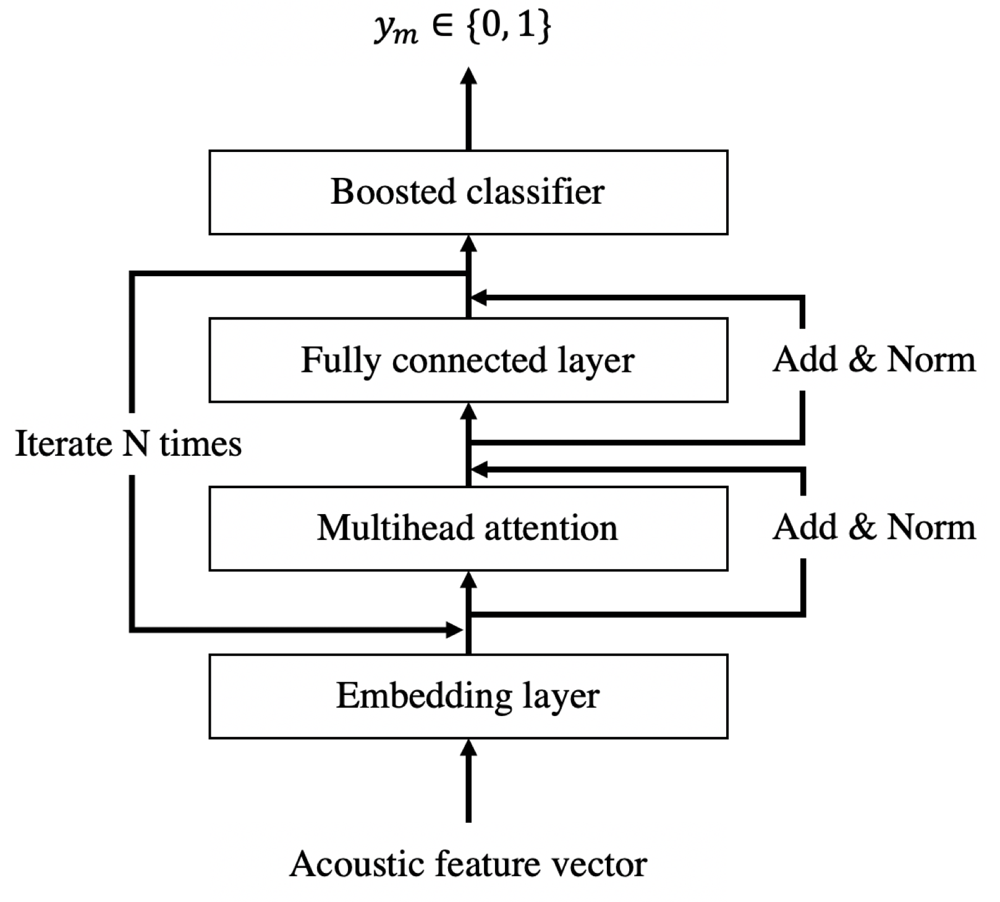
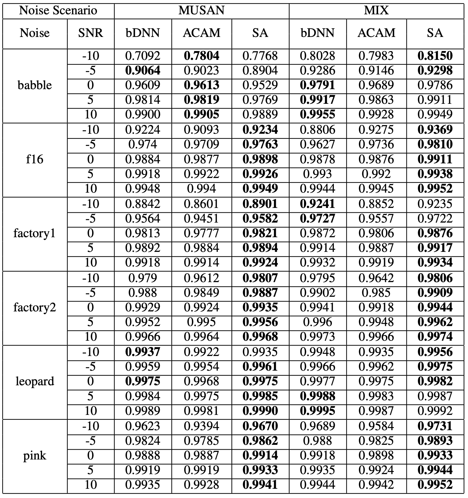
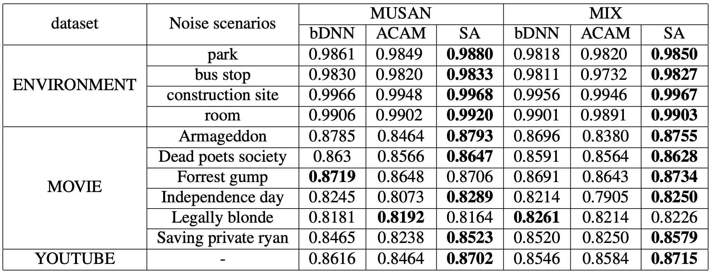

## SELF-ATTENTIVE VAD: CONTEXT-AWARE DETECTION OF VOICE FROM NOISE (ICASSP 2021)


Pytorch implementation of SELF-ATTENTIVE VAD | [Paper](https://ieeexplore.ieee.org/document/9413961)  | [Dataset](https://drive.google.com/file/d/1sVjsI1ZvoPWa91EpEf99Day29CGnYGK8/view?usp=sharing) 

**[Yong Rae Jo](https://github.com/dreamgonfly), [Youngki Moon](https://github.com/ykmoon), [Won Ik Cho ](https://github.com/warnikchow), and Geun Sik Jo**

Voithru Inc., Inha University, Seoul National University.

[ 2021 IEEE International Conference on Acoustics, Speech and Signal Processing (ICASSP)](https://2021.ieeeicassp.org/default.asp)

## Abstract
Recent voice activity detection (VAD) schemes have aimed at leveraging the decent neural architectures, but few were successful with applying the attention network due to its high reliance on the encoder-decoder framework. This has often let the built systems have a high dependency on the re- current neural networks, which are costly and sometimes less context-sensitive considering the scale and property of acoustic frames. To cope with this issue with the self- attention mechanism and achieve a simple, powerful, and environment-robust VAD, we first adopt the self-attention architecture in building up the modules for voice detection and boosted prediction. Our model surpasses the previous neural architectures in view of low signal-to-ratio and noisy real-world scenarios, at the same time displaying the robust- ness regarding the noise types. We make the test labels on movie data publicly available for the fair competition and future progress.

## Getting started
### Installation
```bash
$ git clone https://github.com/voithru/voice-activity-detection.git
$ cd voice-activity-detection
```
#### Linux
```bash
$ pip install -r requirements.txt
```

### Main
```bash
$ python main.py --help
```

### Training
```bash
$ python main.py train --help
Usage: main.py train [OPTIONS] CONFIG_PATH
```
### Evaluation
```bash
$ python main.py evaluate --help
Usage: main.py evaluate [OPTIONS] EVAL_PATH CHECKPOINT_PATH
```
### Inference
```bash
$ python main.py predict --help
Usage: main.py predict [OPTIONS] AUDIO_PATH CHECKPOINT_PATH
```

## Overview
<p align="center">
  
  <br>
  <b>Figure. Overall architecture</b>
</p>

### Results

<p align="center">
  
  <br>
  <b>Figure. Test result - Noisex92</b>
</p>

<p align="center">
  
  <br>
  <b>Figure. Test result - Real-world audio dataset</b>
</p>

## Citation
```
@INPROCEEDINGS{9413961,
  author={Jo, Yong Rae and Ki Moon, Young and Cho, Won Ik and Sik Jo, Geun},
  booktitle={ICASSP 2021 - 2021 IEEE International Conference on Acoustics, Speech and Signal Processing (ICASSP)}, 
  title={Self-Attentive VAD: Context-Aware Detection of Voice from Noise}, 
  year={2021},
  volume={},
  number={},
  pages={6808-6812},
  doi={10.1109/ICASSP39728.2021.9413961}}
```